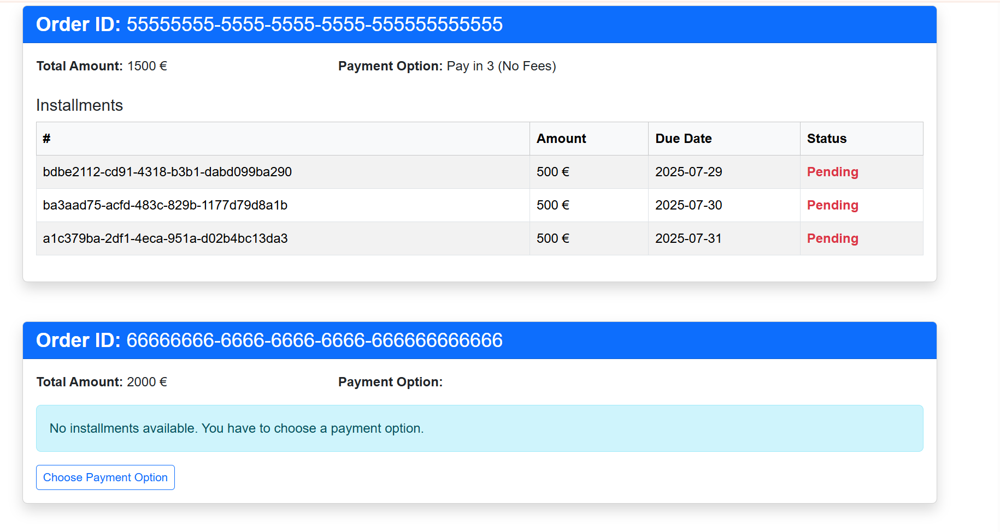
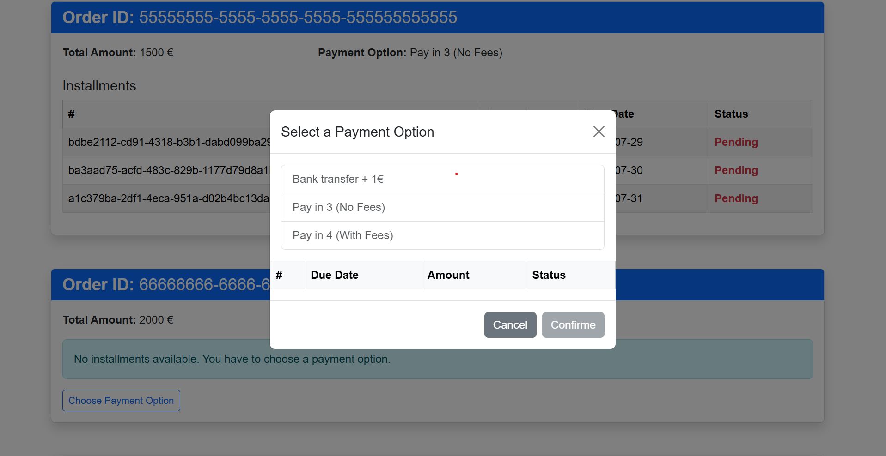
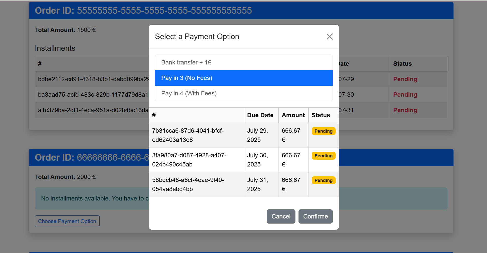
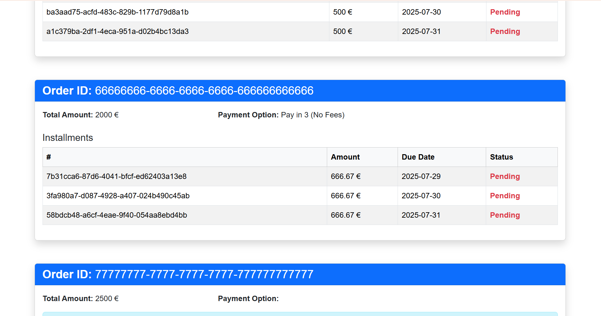

⚙️ java-kata – Backend Spring Boot (API de Commande)
Cette application expose des endpoints REST pour gérer des commandes (Order) avec différentes options de paiement (PaymentOption) et génère automatiquement un échéancier de paiement selon la méthode choisie.

📦 Fonctionnalités

Calcul dynamique des échéances (Installments)

Gestion d'options de paiement (avec ou sans frais)

🧑‍💻 Technologies utilisées

 - Java 21
 - Spring Boot 3.2+
 - Angular 20

🚀  Lancer avec Docker Compose
⚠️ Assurez-vous que Docker et docker-compose sont installés.

IHM 

1. 📦 Identifier la commande
   Repérez la section correspondant à votre Order ID.

   

Vérifiez le montant total de la commande affiché en euros.

2. 🟦 Cliquer sur Choose Payment Option
   Si aucun plan de paiement n'est encore défini, cliquez sur le bouton Choose Payment Option.

   

Une fenêtre modale s’ouvrira.

3. 🧾 Sélectionner une option dans la liste
   Vous verrez plusieurs options telles que :

   

- Bank transfer + 1€

- Pay in 3 (No Fees)

- Pay in 4 (With Fees)

    Cliquez sur l’option souhaitée. Un indicateur (•) apparaîtra pour confirmer la sélection.

4. 📆 Aperçu des échéances (installments)
   Après avoir sélectionné une option, les échéances de paiement s’affichent dans un tableau :

   

 - identifiant de l’échéance
    
    Amount : montant de chaque paiement
    
    Due Date : date d’échéance
    
    Status : état de l’échéance (Pending, etc.)

5. ✅ Confirmer le choix
   Cliquez sur le bouton Confirm pour valider le plan de paiement.

    Le plan sélectionné sera désormais visible dans la section principale de la commande sous Payment Option.

   

Order — Représente une commande client

✅ Champs :
- UUID id – Identifiant unique de la commande.

- BigDecimal amount – Montant total de la commande.

- PaymentOption paymentOption – Option de paiement choisie (ex. : Paiement en 3 fois).

- List<Installment> installments – Liste des échéances liées à cette commande.

🔗 Relations :
- @OneToMany vers Installment — Une commande peut avoir plusieurs échéances.

💰 Installment — Représente une échéance de paiement
 Installment
✅ Champs :
- UUID id – Identifiant unique de l'échéance.

- LocalDate dueDate – Date d’échéance de ce paiement.

- boolean status – Statut de paiement (true si payé, false sinon).

- BigDecimal amount – Montant de cette échéance.

- Order order – Référence à la commande liée à cette échéance.

🔗 Relations :
- @ManyToOne vers Order — Plusieurs échéances peuvent être liées à une seule commande.

🔀 Endpoints exposés

📌 POST /api/orders/generate
Génère un échéancier de paiement à partir d’une commande (OrderResponseDto).

Entrée : OrderResponseDto (id, montant, option de paiement, etc.)

Traitement :

 - Conversion du DTO vers l’entité Order
   Appel au service pour générer les échéances
   Conversion de l’objet Order retourné en DTO enrichi (avec échéances)
   Sortie : OrderResponseDto enrichi avec les échéances (installments)

✅ Utilisé pour créer une nouvelle commande avec échéancier.

🛠 POST /api/orders/updateOrder
Met à jour une commande existante.

Entrée : OrderResponseDto

Traitement :

   - Conversion en entité Order
      Appel au service updateOrder
      Conversion du résultat en OrderResponseDto
      Sortie : Commande mise à jour au format DTO

✅ Utilisé pour changer l’option de paiement ou les données de la commande.

📄 GET /api/orders/findAll
Récupère toutes les commandes existantes.

Sortie : Liste de OrderResponseDto

Traitement :

   - Récupère toutes les entités Order
      Mappe chaque entité vers un DTO via OrderMapper

✅ Utilisé pour afficher toutes les commandes existantes, avec leur option de paiement et échéances.

